# ChronoGraph AI

### Temporal Knowledge & Long-Term Memory Engine

ChronoGraph is an event-sourced temporal knowledge engine that preserves how facts change over time, binds derived knowledge to source evidence, resolves entities conservatively, supports point-in-time graph queries, and assembles governed long-term memory for AI agents.

It is an original Python implementation designed for transparent local development. Routine use, tests, CI, replay, and evaluation need no paid API, cloud database, or production credential.

## Why ChronoGraph

Most retrieval systems answer from the latest indexed text. They do not reliably answer questions such as:

- Who employed Alice on January 15?
- What did the system believe about that date before a correction arrived?
- Which source supports the answer?
- Is the result disputed, superseded, sensitive, or outside a memory policy?

ChronoGraph stores immutable source episodes and materializes evidence-backed entities and temporal facts. Every fact has a valid-time interval and a system-time recording point. Exclusive relations can be superseded or disputed without erasing their history.

## Core model

- **Episodes** are immutable source events with a content hash, event time, observed time, source type, sensitivity, and idempotency controls.
- **Entities** use typed canonical names, source-bound aliases, and explicit identifiers. Resolution accepts exact evidence and preserves ambiguity.
- **Facts** connect typed subjects to entities or literals. Each fact carries valid time, recorded time, confidence, sensitivity, schema version, evidence, and source episode references.
- **Provenance** links every accepted fact to an evidence record and source episode. Facts cannot be constructed without evidence identifiers.
- **Temporal resolution** closes older exclusive facts when a later valid-time assertion replaces them. Incompatible facts with no justified succession become disputed.
- **Memory bundles** combine temporal retrieval with source, sensitivity, age, type, conflict, item, character, entity, and graph-depth policies.

See [the temporal model](docs/temporal-model.md) for precise valid-time and system-time semantics.

## Architecture

```mermaid
flowchart LR
    E[Episode] --> I[Ingestion]
    I --> EE[Entity Extraction]
    EE --> ER[Entity Resolution]
    ER --> FE[Fact Extraction]
    FE --> OV[Ontology Validation]
    OV --> P[Provenance]
    P --> TR[Temporal Resolver]
    TR --> CS[Conflict / Supersession]
    CS --> GS[Graph Store]
    GS --> TQ[Temporal Query]
    TQ --> HR[Hybrid Retrieval]
    HR --> MA[Memory Assembly]
```



The implementation separates providers, ontology, storage, audit, observability, retention, retrieval, and service layers behind typed boundaries. Read [architecture.md](docs/architecture.md) for data flow and trust boundaries.

## Install

ChronoGraph requires Python 3.12 or newer.

```bash
python -m venv .venv
python -m pip install -e ".[dev]"
```

## Deterministic demo

```bash
chronograph demo
```

The demo ingests "Alice works at Acme" followed by "Alice now works at Orbit" and prints the current fact, historical fact, provenance, and governed memory bundle. It does not call an external model.

Run the evaluation scenarios:

```bash
chronograph eval
```

The evaluation is a deterministic correctness harness, not a performance or accuracy benchmark.

## CLI

```bash
chronograph --help
chronograph --db chronograph.db ingest fixtures/demo_episodes.json
chronograph --db chronograph.db query "Alice employer" --at 2026-03-01T00:00:00Z
chronograph --db chronograph.db as-of 2026-01-15T00:00:00Z "Alice employer"
chronograph --db chronograph.db integrity
chronograph replay fixtures/demo_episodes.json
```

JSON and JSONL episode fixtures are validated before ingestion.

## API

Start the local FastAPI service:

```bash
uvicorn chronograph_ai.api:app --reload
```

OpenAPI is available at `/docs`. Example ingestion:

```bash
curl -X POST http://127.0.0.1:8000/episodes \
  -H "content-type: application/json" \
  -d '{
    "source_type": "structured_record",
    "source_id": "employment-1",
    "content": "Alice works at Acme.",
    "event_time": "2026-01-01T00:00:00Z",
    "observed_at": "2026-01-01T00:00:00Z",
    "idempotency_key": "employment-1"
  }'
```

Point-in-time graph query:

```bash
curl -X POST http://127.0.0.1:8000/query/as-of \
  -H "content-type: application/json" \
  -d '{"valid_time":"2026-01-15T00:00:00Z"}'
```

Implemented endpoints cover health, episode ingestion/readback, entity read/history/neighbors, ranked query, as-of snapshot, fact/provenance, merge proposals and decisions, memory assembly, integrity, and statistics.

## Retrieval and ranking

Hybrid retrieval evaluates only temporally valid facts. The deterministic score combines lexical, entity, graph-distance, temporal, source-priority, and local semantic signals with documented weights. Every result exposes each component and its explanation. Scores are ranking signals, not calibrated probabilities.

## Replay and integrity

Replay sorts validated episodes by observed time, event time, and source ID, then ingests them into a fresh graph. Canonical state digests allow deterministic comparison. The integrity checker reports orphan references, missing provenance, invalid intervals, dangling supersession, active exclusive overlaps, and forbidden relation cycles.

## Supported backends and providers

- In-memory graph store for tests and embedded use.
- SQLite canonical-state adapter for local persistence and CLI workflows.
- Deterministic entity extraction, fact extraction, embeddings, reranking, and model-provider substitutes for offline CI.
- Typed protocols for graph stores, extraction, embeddings, reranking, auth, and instrumentation.

## Security and limitations

Source text and metadata are untrusted data. Typed validation, bounded sizes, depth/result limits, ontology checks, evidence requirements, and secret-aware audit sanitization reduce risk. These controls do not make arbitrary external providers trustworthy.

The default API auth provider permits requests for local development. Deployments must inject authentication and authorization at the API boundary. The current model is single-tenant. SQLite is a local checkpoint store and does not support distributed writers or graph-native query planning. No Neo4j, FalkorDB, PostgreSQL, vector database, external LLM, or OpenTelemetry adapter is implemented. No production-scale, latency, compliance, accuracy, or operational-usage claim is made.

Read [security.md](docs/security.md), [memory.md](docs/memory.md), and [development.md](docs/development.md) before deployment work.

## Project documents

- [Architecture](docs/architecture.md)
- [Temporal model](docs/temporal-model.md)
- [Ontology](docs/ontology.md)
- [Agent memory](docs/memory.md)
- [Security](docs/security.md)
- [Development](docs/development.md)
- [Evaluation](docs/evaluation.md)
- [Architecture decisions](docs/decisions.md)
- [Research references and independent-implementation statement](REFERENCES.md)
- [Contributing](CONTRIBUTING.md)
- [Security reporting](SECURITY.md)

## License

Original ChronoGraph code is released under the [MIT License](LICENSE). Dependencies remain under their respective licenses.
