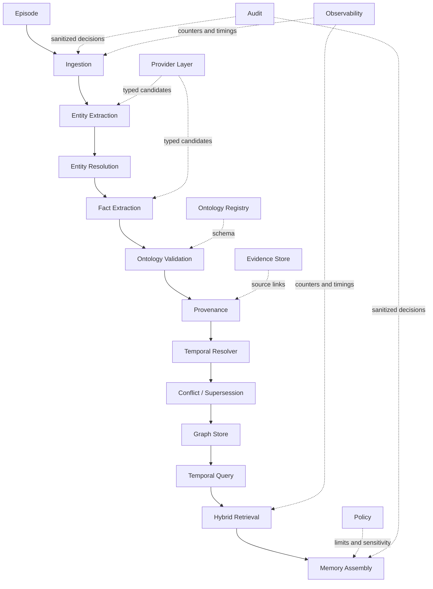

# Architecture

ChronoGraph turns immutable episodes into evidence-backed temporal graph projections. The projection can be rebuilt through deterministic replay; source evidence and audit records remain distinct from the query model.

## Ingestion and query flow

## State boundaries

| Boundary | Input | Stored state | Guarantee |
| --- | --- | --- | --- |
| Episode boundary | Typed source payload | Original content, metadata, times, hash | Size, timezone, and idempotency validation |
| Provider boundary | Episode as untrusted data | No direct state mutation | Candidate output is revalidated with strict Pydantic adapters |
| Ontology boundary | Entity and fact candidates | Versioned schema name on each fact | Unknown or invalid types are rejected before episode commit |
| Evidence boundary | Accepted fact candidate | Evidence path, extractor identity/version, source hash | Every fact needs evidence and episode references |
| Temporal boundary | Validated fact | Valid/system times, status, supersession, conflict sets | History is preserved; incompatible assertions are explicit |
| Store boundary | Typed domain objects | In-memory maps or SQLite canonical snapshot | Stable ordering and canonical serialization |
| Query boundary | Time lens and bounded filters | No mutation except instrumentation | Result/depth bounds and explainable scores |
| Memory boundary | Query plus policy | Bundle and sanitized audit metadata | Sensitivity, source, age, conflict, graph, and budget controls |

## Components

`ChronoGraphEngine` orchestrates ingestion, temporal queries, traversal, merge controls, provenance, and snapshots. It holds no database-specific query language.

`OntologyRegistry` owns immutable schema versions. `EntityResolver` uses exact identifiers and exact normalized canonical/alias matches; ambiguity creates a separate identity. `TemporalResolver` applies exclusive relation semantics. `HybridRetriever` ranks temporally valid facts. `MemoryAssembler` applies policy after retrieval. `RetentionManager` handles expiration, redaction, tombstones, and explicitly authorized purge.

`GraphStore` is a protocol. `InMemoryGraphStore` is deterministic and process-local. `SQLiteGraphStore` persists a canonical logical snapshot in a transaction after each mutation. The adapter is deliberately optimized for correctness and local replay, not distributed write throughput.

## Provider and trust model

The default providers are deterministic and offline. Extractors recognize a narrow local grammar or consume strictly typed metadata fixtures. Provider output is not trusted: it is revalidated and ontology-checked before the episode is stored. An external provider can be supplied through a protocol, but timeout, transport, credential, and vendor retention controls belong to that adapter and deployment.

## Mutation ordering and concurrency

One engine serializes ingestion with a reentrant lock. Idempotency is checked inside that boundary. Store methods also protect mutations. This provides deterministic in-process behavior, including concurrent duplicate ingestion. It is not a distributed lock and does not make the SQLite adapter a multi-writer cluster.

## Public surfaces

- FastAPI supplies typed HTTP routes and generated OpenAPI documentation.
- Typer supplies local ingestion, query, memory, replay, evaluation, statistics, integrity, and demo commands.
- The evaluation harness exercises ten deterministic correctness scenarios.
- Provider-neutral instrumentation exposes in-memory counters, observations, and timers without a telemetry dependency.
